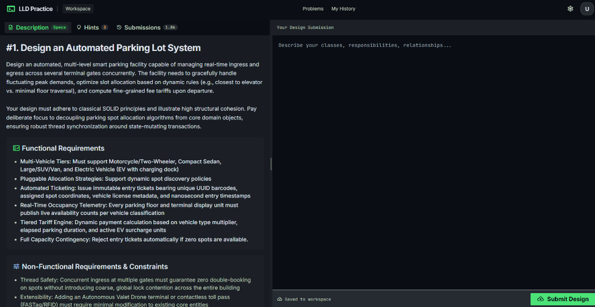
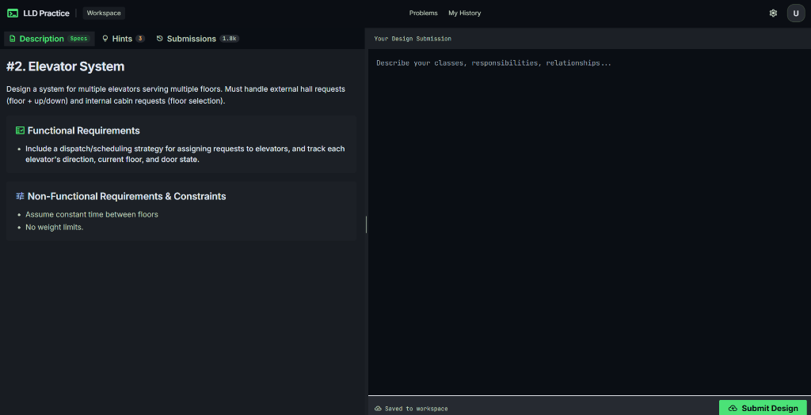
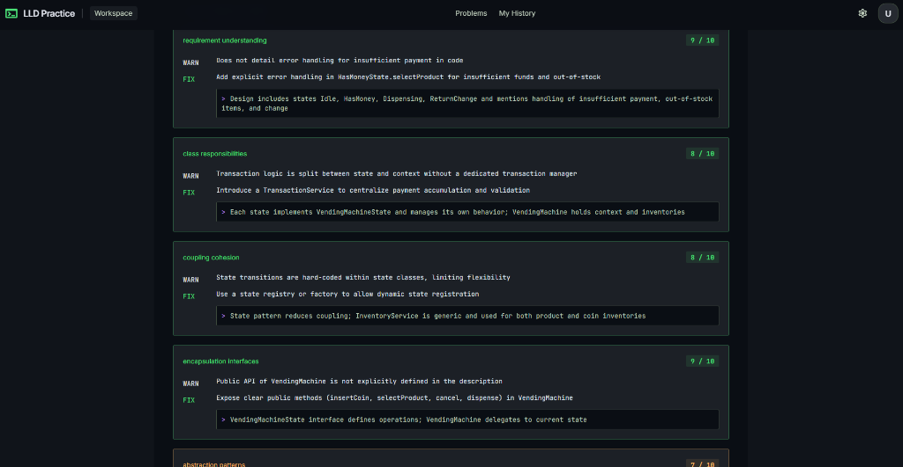
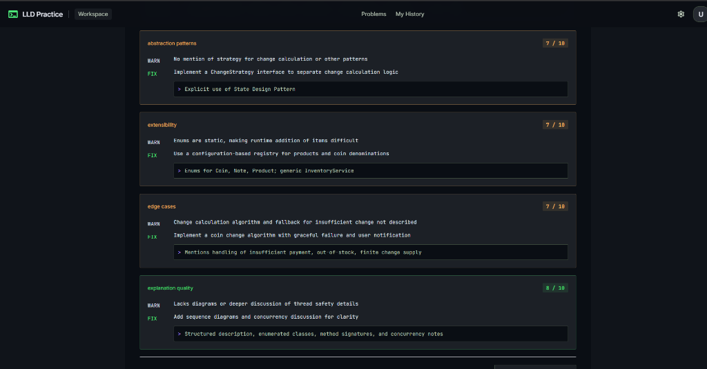

# LLD Practice Platform

A prototype platform that allows learners to practice Low-Level Design (LLD) problems, submit text-based designs, and receive AI-generated structured feedback.

## Screenshots & UI Preview

### 1. Problem Solving Workspace
Learners review requirements, assumptions, and constraints in the context panel while writing their plain-text design solution in the submission workspace:

#### Automated Parking Lot System


#### Elevator System


### 2. AI-Powered Evaluation & Rubric Feedback
Submissions are evaluated asynchronously against structured architectural criteria (requirement understanding, class responsibilities, coupling & cohesion, encapsulation, design patterns, extensibility, edge cases, and explanation quality):

#### Evaluation Feedback - Criteria & Scores (Part 1)


#### Evaluation Feedback - Deep-Dive & Actionable Fixes (Part 2)


## Tech Stack
- **Backend:** Java 17, Spring Boot (Spring Web, Spring Data JPA)
- **Database:** H2 Database (File-based storage to survive restarts)
- **Frontend:** React + Vite
- **AI Integration:** OpenAI API (GPT-4o-mini)

## Key Design Decisions
1. **Domain Model Extensibility:** The platform separates `Submission` format and `Evaluator` interface to easily allow diagram-based submissions or human reviewers in the future without rewriting the core practice flow.
2. **File-based H2 Database:** H2 was chosen to keep setup simple (zero installation) while persisting data across restarts using file storage (`./data/lldpractice`).
3. **Async Evaluation Workflow:** The LLM evaluation operates entirely asynchronously. The submission returns immediately (`SUBMITTED`), the background process transitions to `EVALUATING`, and eventually moves to `COMPLETED` or `FAILED`. This ensures the UI remains snappy and the frontend polls for updates.
4. **Resilient AI Feedback:** The `LlmEvaluator` uses a strict JSON schema prompt and is wrapped with error-handling and a 20s timeout. If the LLM output parsing fails, the system transitions gracefully to the `FAILED` state.

## How to Run

### Backend
1. Ensure Java 17+ is installed.
2. Set your OpenAI API key in the environment:
   ```bash
   export LLM_API_KEY=your_openai_api_key_here
   ```
   *(On Windows PowerShell: `$env:LLM_API_KEY="your_key_here"`)*
3. Navigate to the `backend` directory and run the application:
   ```bash
   cd backend
   ./mvnw spring-boot:run
   ```
   *(On Windows: `.\mvnw spring-boot:run`)*

### Frontend
1. Ensure Node.js is installed.
2. Navigate to the `frontend` directory:
   ```bash
   cd frontend
   npm install
   npm run dev
   ```
3. Open `http://localhost:5173` in your browser.

## Known Limitations
- Single-user mode: Authentication is not implemented as per MVP scope.
- Hardcoded Polling: The frontend uses HTTP polling every 3 seconds to check for evaluation completion. For a production system, Server-Sent Events (SSE) or WebSockets could be more optimal.
- No Markdown Rendering: Text submissions and feedback are rendered in simple `pre` tags rather than rich markdown.


# AI Usage Document

*This document outlines 3-5 real AI-assisted decisions made during this build.*

### 1. Decision: [Placeholder]
- **What was suggested:** [Placeholder]
- **What I accepted/rejected:** [Placeholder]
- **Why:** [Placeholder]

### 2. Decision: [Placeholder]
- **What was suggested:** [Placeholder]
- **What I accepted/rejected:** [Placeholder]
- **Why:** [Placeholder]

### 3. Decision: [Placeholder]
- **What was suggested:** [Placeholder]
- **What I accepted/rejected:** [Placeholder]
- **Why:** [Placeholder]

### 4. Decision: [Placeholder]
- **What was suggested:** [Placeholder]
- **What I accepted/rejected:** [Placeholder]
- **Why:** [Placeholder]
